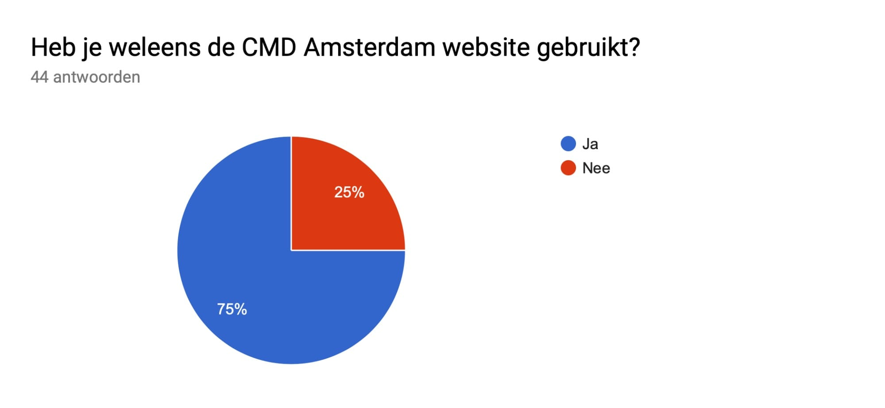
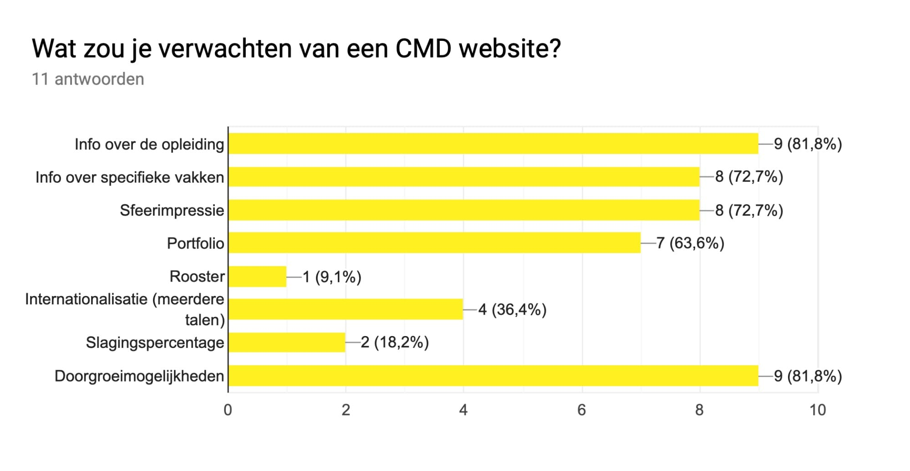
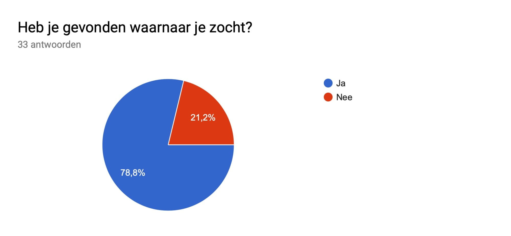
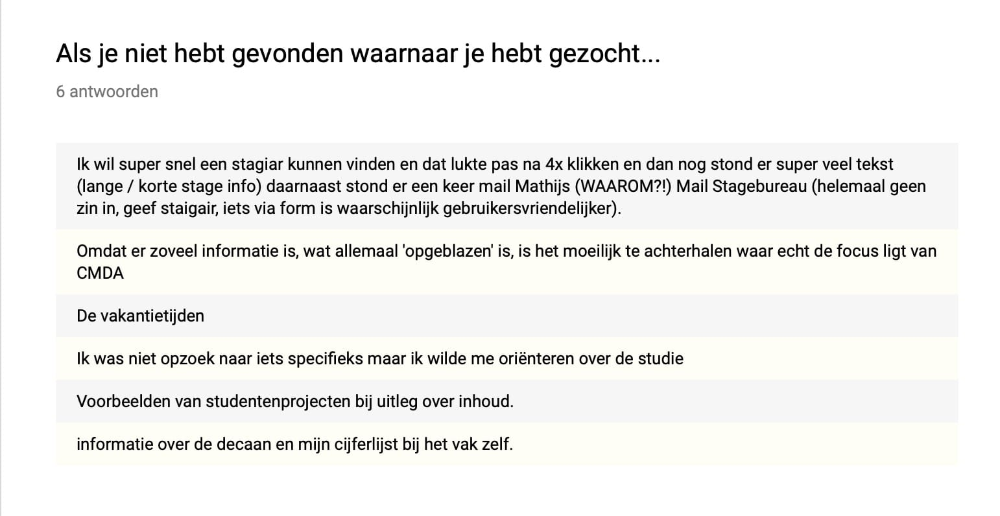
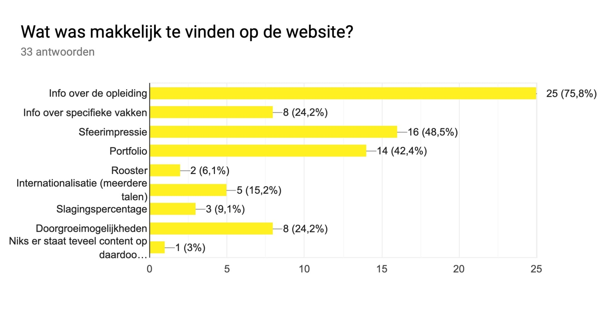
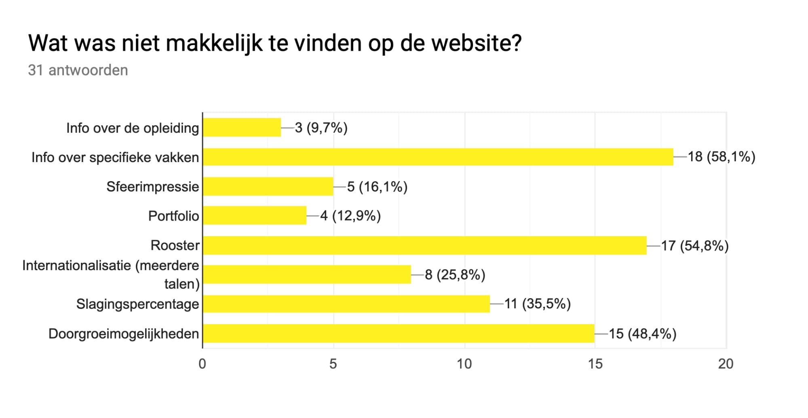
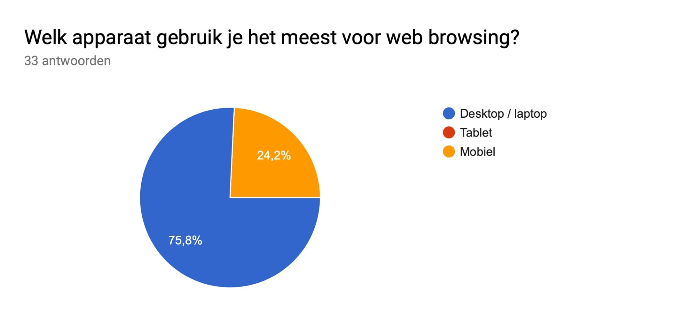
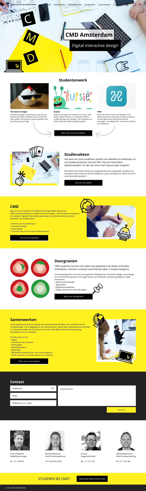
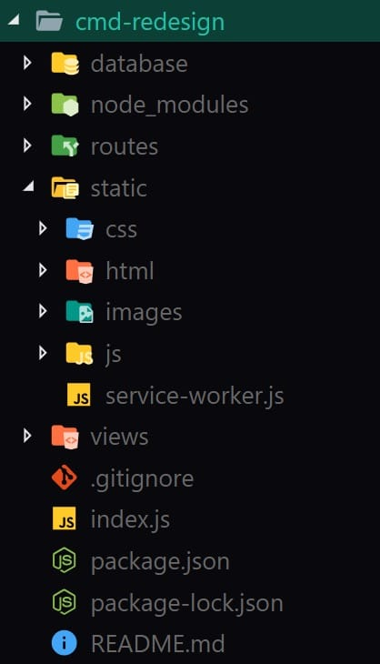

# Design rationale

## Inhoudsopgave
* [Probleem definitie](#probleem-definitie)
* [Debriefing](#debriefing)
* [Onderzoek](#onderzoek)
  * [Vragenlijst](#vragenlijst)
  * [Design](#design)
  * [Toegankelijkheid](#toegankelijkheid)
  * [Performance](#performance)
* [Digitaal prototype](#digitaal-prototype)
  * [Ontwerp](#ontwerp)
* [CMS](#cms)
* [Uitleg code](#uitleg-code)
  * [Mappenstructuur](#mappenstructuur)
  * [Libraries en frameworks](#libraries-en-frameworks)

## Probleem definitie
Met de briefing van de klant [Link naar briefing] (https://drive.google.com/file/d/1rBurWfk8n9LhiGFRDDUfdoLEBGe04fUW/view) kwam het probleem van de CMD Amsterdam website naar voren. De website is te traag, toegankelijkheid is erg, wat beide wordt veroorzaakt door een Wordpress-thema dat opmaak en data in elkaar verwikkelt als spaghetti.

Het was duidelijk dat er een nieuwe website moest komen die al deze problemen verhelpt.

Tijdens de briefing kwamen een aantal details naar boven die van belang waren voor tijdens het project:
* Rekening houden met mobiele gebruikers
* Rekening houden met de huisstijl van CMD
* Doelgroep is bedrijven en aankomende studenten
* Studentenwerk meer naar voren brengen
* Unieke eigenschappen van CMD naar voren brengen
* Onderscheiden van de concurrentie / soortgelijke opleidingen
* Website sneller en toegankelijker maken
* De huidige website is volledig in WordPress gebouwd
* De nieuwe website hoeft niet met WordPress worden gebouwd
* Klant moet content bewerken zonder diepgaande kennis van code
* Gegevens van bezoekers veilig opslaan

## Debriefing
Vanuit de opdracht is er een debriefing gemaakt. In dit document staan alle details van de opdracht en waar aan gedacht moet worden. Zie link naar de debriefing: [Debriefing](https://drive.google.com/open?id=1fd3e3Qep6-8ILxCHOh43qvc6xP5cKbLhfFB2lkkELTU)

## Onderzoek
### Vragenlijst
Om goed te begrijpen wat de doelgroep wil van een CMD Amsterdam website, is er een enquête opgesteld en verspreid onder studenten, docenten en bedrijven (zie link naar enquête: [Enquête](https://drive.google.com/open?id=1ZCEDP2qFXyvtldURwAjYT_fGJYZCdCysMXXrYjNTcz4)

Om een goede onderscheid te maken tussen de doelgroepen, is er als eerste de vraag gesteld of de afnemer eerder de CMD website heeft gebruikt. Zo ja, kregen zij vragen hoe de website verbeterd kon worden en zo nee, kregen zij vragen wat zij verwachten van de CMD website.

De antwoorden die ingevuld worden in de enquête, worden uiteindelijk meegenomen in het ontwerp van de nieuwe CMD website. Uit de testresultaten kwamen er een aantal belangrijke bevindingen naar voren. Zie hieronder een aantal belangrijke uitkomsten uit de enquête.

Bij de gebruikers die niet eerder de CMD website hebben gebruikt is er gekeken wat zij het meest belangrijkste vinden bij een bezoek aan de CMD website (zie afbeelding hieronder).
1. Info over de opleiding
2. Doorgroeimogelijkheden
3. Info over specifieke vakken
4. Sfeerimpressie
5. Portfolio

De gebruikers die eerder de CMD website hebben bezocht is gevraagd of zij de huidige website overzichtelijk vonden of juist niet. Zie hieronder de resultaten.

Daarnaast waren de belangrijkste vragen voor de gebruikers die eerder de CMD website hebben bezocht, welke onderwerpen zij makkelijk vonden om te vinden en welke onderwerpen juist niet. Daaruit kwam het volgende uit:

1. Info over de opleiding
2. Sfeerimpressie
3. Portfolio

1. Info over specifieke vakken
2. Rooster
3. Doorgroeimogelijkheden

Als laatste is er gekeken welke apparaten zij het meest gebruiken voor web browsing, daar kwam naar voren dat dekstop het meeste voorkwam en daarna de mobiele telefoons.

Door de antwoorden met de niet eerder bezochte gebruikers en de gebruikers die wel eerder de website hebben bezocht te vergelijken, werd er een keuze gemaakt welke onderwerpen het beste terug kan komen op de website van CMD. Aangezien de antwoorden van de niet eerder bezochte gebruikers overeenkomen met de top 3 antwoorden van de vragen wat niet makkelijk en juist wel makkelijk te vinden waren op de website, is er gekozen om de volgende onderwerpen terug te laten komen in het ontwerp:
1. Info over de opleiding
2. Info over specifieke vakken
3. Doorgroeimogelijkheden
4. Portfolio
5. Samenwerking

Tijdens het verspreiden van de vragenlijst, was er ook een onderzoek gaande over design, toegankelijkheid en presentaties over de huidige CMD Amsterdam website. En alternatieve oplossingen voor een content management systeem voor de nieuwe website.
[Link naar onderzoeksdocument](https://drive.google.com/open?id=1SnpVNgyRN-Q56ykefNBBXCozxoAu3xuyoDyoihSdhHo)

Dit onderzoek kon gebruikt worden bij het bouwen van een nieuwe website.

### Design
Wat vooral opvalt bij het bekijken van de verschillende websites, is dat het overgrote deel een standaard indeling heeft: een grote afbeeldingen bovenaan de pagina met eventueel een titel en een ondertitel in de afbeelding. Daarnaast gebruiken zij kleuren om de belangrijkste elementen naar voren te laten springen.

Wat de CMD pagina goed doet is dat zij een eigen website hebben ontwikkeld voor specifiek de opleiding communication and multimedia design. Hierdoor onderscheiden zij zich met het delen van de juiste informatie voor de gebruiker.

Hoe staat de CMD website ten opzichte van het onderzoek?
Tijdens het onderzoek werd er gekeken naar een aantal punten waar er rekening mee gehouden moest worden voor tijdens het ontwerpen van een website.

**Hieruit kwam het volgende naar voren:**
- **Voorkom het gebruik van carrousels, sliders, tabs en accordeons.**
De CMD website maakt geen gebruik tabs en accordeons, hierdoor zorgen zij er voor dat de content niet wordt verstopt, wat ervoor kan zorgen dat de website aantrekkelijker wordt om te gebruiken.

- **Scrollen boven klikken**
Wat opvalt is dat de CMD website veel doorverwezen wordt naar een andere link of pagina. Uit het onderzoek is gebleken dat scrollen juist efficiënter en sneller werkt dan het doorverwijzen naar een nieuwe pagina. Ook is scrollen door een pagina relatief sneller en voorkomt het dat de gebruiker stappen overslaat of dat zij een aantal stappen overslaan.

Om dit probleem te voorkomen, kan de CMD website uit een aantal opties kiezen om dit probleem op te lossen, namelijk:

- Minder teksten gebruiken
- Alles op één pagina zetten, in plaats van het doorverwijzen
- Elke onderdeel zijn eigen pagina te geven.
- Visuele aanwijzingen

De CMD-website maakt veel gebruik van afbeeldingen. Wat vooral goed is, is dat zij afbeeldingen gebruiken om de gebruiker te sturen.

Maar het probleem aan de website, is dat zij voornamelijk doorverwijzen door middel van links en buttons. Zoals eerder is verteld, doen afbeeldingen het erg goed. Maar om de gebruiker nog beter aan te sturen kan de CMD overwegen om pijltjes te gebruiken om de bezoeker aan te sturen op de website. Ook kan er voor gekozen worden om de buttons “opvallender” vorm te geven waardoor dit meer naar voren gaat springen.

Daarnaast heeft CMD een eigen huisstijl ontwikkeld en opgeschreven in een handleiding. Aangezien zij ook als enige een unieke website hebben ontwikkeld voor de opleiding zou dit een goede unique selling point kunnen zijn voor de opleiding tegenover hun concurrenten.

Om dit beter naar voren te laten brengen, zouden zij als opleiding kunnen overwegen om de huisstijl nog beter toe te passen en te verwerken in de website, waardoor zij nog meer kunnen opvallen en zo een imago creëren voor de bezoeker. Hierdoor creëren ze niet alleen image maar ook een beeld die voor de gebruiker altijd bij zou blijven.

- **Overzichtelijke pagina**
De website maakt gebruik van max 5 kleuren. Hierdoor blijft de website mooi overzichtelijk. Ook maken zij onderscheid tussen titels en subkoppen, waardoor de gebruiker eenvoudig door de titels heen kan scannen.

Ook maken zij gebruik van veel foto’s op de website met voldoende ruimte. Wat opvalt bij de CMD website is dat zij veel teksten hebben voor elk onderdeel. Om de website nog overzichtelijker te maken kan er voor gekozen worden om gebruik te maken met de volgende punten:

Minder tekst (kortere alinea’s)
Gebruik maken van bullet points
Meer witruimtes geven tussen de content blokken

- **Responsive vormgeving**
De CMD website is nog redelijk responsive en er is voldoende rekening gehouden met het aantal wit ruimtes. 

Wat wel opvalt is dat de website begint met een foto bovenaan. Waar de CMD website rekening moet houden is dat een mobiel gebruiker veel meer moet scrollen dan een desktop gebruiker. Hierdoor zou de CMD moeten overwegen om te denken aan de volgende punten:

Zijn het te veel teksten voor op een mobiele telefoon?
Wat is het belangrijkste wat getoond moet worden aan de gebruiker?

### Toegankelijkheid
Voordat wij onze expertise gingen uitoefenen, was de website verre van toegankelijk. Er was een aantal grote fouten, die echt opgelost moesten worden, maar daarnaast waren er een heleboel kleine dingetjes die het ook daadwerkelijk leuker maakten voor mensen met een beperking om door de website te navigeren.

De huidige CMD-website scoort slechts 81% op een accessibility-test. Dat klinkt misschien best aardig, maar als je weet dat het heel makkelijk is om 100% te scoren, klinkt het niet meer zo goed.

#### Inzoomen op het probleem
Een van de eerste en tevens ergste dingen is dat de pagina niet schaalbaar is. Inzoomen en uitzoomen kan allebei niet. Mensen die problemen hebben met zicht mogen het dus maar lekker uitzoeken, en als je ergens op de site wil inzoomen ben je ook de sjaak -- dat moet anders. Het W3C (World Wide Web Consortium) stelt dat de mogelijkheid tot zoomen verplicht is voor een website die door iedereen gebruikt kan worden (1). Het mooie is dat dit probleem een hele makkelijke oplossing heeft: laat de gebruiker zoomen! Je hoeft alleen een minimum scale aan te geven, want het standaard zoomniveau moet het “minimaal leesbare product” zijn. Vanaf daar zou iedereen in mogen zoomen, nietwaar?

#### Waar ben ik?
Het volgende probleem was dat sommige links geen beschrijvende tekst bevatten, alleen een icoontje. Blinde mensen zouden absoluut niet weten waar die link voor is, want screenreaders hebben geen tekst om voor te lezen, en icoontjes kun je niet uitspreken, tenzij je letterlijk vertelt wat het is (2). Ook de bots van Google hebben geen idee wat alles inhoudt (3). Een snelle scan over de pagina, bij alles een korte beschrijving toegevoegd, alle beschrijvingen alleen zichtbaar gemaakt voor screenreaders en voila! 100% accessible.

#### Overige tests
Nou zijn er nog best veel dingen die de computer niet automatisch voor ons kan testen, dus écht 100% toegankelijk is het nog niet. Gelukkig kan ik dat wel handmatig testen.

Het eerste dat mij opviel was dat ik niet met tab kon navigeren. Dat was heel raar, want dat zou altijd moeten werken. Wat bleek: elk element waarop werd gefocust had geen duidelijke focus-state. Zelfs mensen zonder enige beperking kunnen daardoor niet goed navigeren (4). Ik heb even simpel een outline toegevoegd, en nu kan iedereen zien waarop ze focussen.
Daarnaast had de website totaal geen structuur. Dat wil zeggen: Met je ogen kun je misschien wel zien wat belangrijk is, wat de paginatitel is, enzovoorts. Maar een screenreader kan dat niet. Alle titels hebben dezelfde weging. Voor screen readers (maar ook voor bijvoorbeeld Google), heeft de CMD website **géén** titel. Een kwestie van de eerste en grootste titel ook het juiste semantische element te maken en het was opgelost.

Als laatste is er nog het probleem dat de website absoluut niet goed in elkaar zit op semantisch niveau. Elk element is een div met daarin een div met daarin een div met daarin een div, enzovoorts. Naast dat zoveel elementen niet nodig zijn en de pagina langzaam maken, betekent dit ook voor computergestuurde hulpprogramma’s zoals je screenreader of Googles scraper-bots dat er weinig tot geen structuur te vinden valt (5). Wat is de main content? Bestaat het uit artikelen? Wat is het menu? Jij en ik weten het, maar voor de rest is het div-soep.

#### Bronnen
* [1](https://www.w3.org/TR/UNDERSTANDING-WCAG20/visual-audio-contrast-scale.html)
* [2](https://support.google.com/webmasters/answer/114016)
* [3](https://varvy.com/googlebot.html)
* [4](https://webaim.org/techniques/keyboard/)
* [5](https://developer.mozilla.org/en-US/docs/Learn/HTML/Introduction_to_HTML/Document_and_website_structure)

### Performance
De huidige CMD Amsterdam website is niet erg goed qua performance. Er is een test gedaan waaruit het volgende uit kwam.

* Eerste pagina weergave
	* **9.6s**

* Tijd tot interact teerbaar
	* **22.4s**
* CSS code
	* **1.126.696 bytes totaal**
	* **1.093.970 bytes niet gebruikt**
	* **97.1% niet gebruikt**
* JavaScript code
	* **1.050.112 bytes totaal**
	* **768.135 bytes niet gebruikt**
	* **73.1% niet gebruikt**
* **Geen tekst compressie**
* Afbeeldingen
	* **Grote afbeeldingen**
	* **Geen lazy loading**
* Geen caching
* Nadat de font gedownload is, zie je pas tekst
* Teveel verzoeken naar de server (60 verzoeken)
* Uitvoeren van JavaScript duurt te lang (1.6s)

#### Grootte van media
* Afbeeldingen: 2 MB
* CSS: 1 MB
* Script: 1 MB
* HTML: 1 MB
* **Totaal:  4436.2 KB**

Uit het onderzoek van de performance is gebleken dat mensen sneller weggaan van een website als die traag is. Dit is vaak de meest voorkomende reden waarom mensen weggaan. Het is daarom ook erg belangrijk dat een website snel geladen wordt en ook snel aanvoelt. Dit is op dit moment zeker niet het geval met de huidige CMD Amsterdam website. Je zou al met Wordpress verbeteringen door kunnen voeren, maar dit zal nooit op de optimaalste manier kunnen.

## Digitaal prototype
Tijdens dit project waren er diverse ontwerpen gemaakt. Zie link naar de ontwerpen: [Ontwerpen](https://www.figma.com/proto/cJiNncLhuboZtQLevORTb4VC/CMD-Redesign?node-id=0%3A1&viewport=-13000%2C528%2C0.5847303867340088&scaling=min-zoom)

### Ontwerp
Uiteindelijk is dit het ontwerp geworden:

    

Dit ontwerp is uiteindelijk ook uitgewerkt in een digitaal prototype. Zie link naar prototype [Digitaal prototype](http://cmd-redesign.herokuapp.com)

## CMS
De huidige CMD-website draait op Wordpress — de schrik van elke webdeveloper. Omdat de website via Wordpress allerlei thema’s, losse CSS en andere rotzooi importeert, duurt het eeuwen om te website te laden.

Daarnaast vreet dat ook al je zuurverdiende mb’s van je internetabonnement, en dat wil je een gebruiker natuurlijk niet aandoen.

Al gauw bleek dat, om de website sneller en toegankelijker te maken, Wordpress eigenlijk geen optie zou zijn. Dat CMS verwikkeld uit zichzelf opmaak, data en gedrag door elkaar. Dat is niet netjes, en vreselijk om te onderhouden, dus wij besloten een alternatief te bedenken.

Na gebrainstormd te hebben, kwamen we op onze uiteindelijke oplossing: een markdown-editor. Met markdown kun je zonder kennis van HTML, hele uitgebreide en ingewikkelde HTML-documenten schrijven. De redacteurs van de website zouden dan alleen een cursusje markdown moeten volgen, en zouden dan al meteen verder kunnen.

## Uitleg code
### Mappenstructuur

* /database: database en functies om in database op te slaan
* /routes: routes van de applicatie
* /static: alle statische bestanden
	* /css
	* /html
	* /images
	* /js
* /views: webpagina weergaves

### Libraries en frameworks
#### Backend - ExpressJS
We hebben gebruik gemaakt van expressjs omdat we dat alledrie kennen en kunnen. Daarnaast is het ook een heel gemakkelijke library om zo je server op te zetten.

Verder hebben we niet zoveel speciaals gebruikt. We wilden graag zoveel mogelijk gewone javascript schrijven. Geen typescript of andere prul, dat zou ons alleen maar tegenhouden in deze korte tijd. Dat betekent wel dat we geen tests hebben, en ook geen manier om te verifiëren of alles ook wel echt werkt. Misschien handig voor als dit project later wordt opgepakt.

#### Frontend - JustJS
Wij zijn van mening dat niet elke website gebouwd hoeft te worden met een framework of met jQuery. We zijn ook van mening dat de native API’s voor het werken met de DOM en HTTP(S) vreselijk zijn. Om die redenen hebben we een library gepakt die alleen als wrapper werkt voor native API’s, om wat sneller en netter te kunnen programmeren. [Waarom we specifiek voor JustJS hebben gekozen? Dat kan je hier lezen.](https://medium.com/@maanlampje/creating-the-new-jquery-98fe8181f18d?source=friends_link&sk=3ca5eacaa2135b090292d8338e572b4e) Tijdens het project hebben we samen verder gewerkt aan de library.