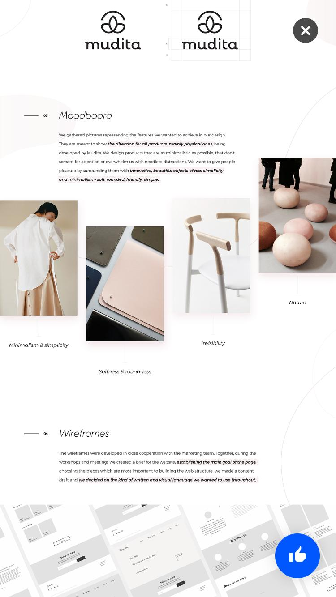

# Product biografie

## Planning
Voor het plannen van het project en een goed overzicht te houden wat er nog gedaan moest worden, is er een Trello board aangemaakt. Daarin zijn alle taken, afspraken en to do's opgeschreven. 


## Werkwijze
Tijdens dit project is er gewerkt in een team van 3 personen, [Tjebbe Marchand](https://github.com/tjebbemarchand), [Wouter Lem](https://github.com/maanlamp) en [Karin Liu](https://github.com/maanlamp). Het project was een periode van 5 weken, elke week is er een meeting met de klant en een project coach.

## Het proces

### Week 1

##### Briefing
Tijdens de kick-off werd er een briefing gegeven over het project
[Link naar briefing](https://drive.google.com/file/d/1rBurWfk8n9LhiGFRDDUfdoLEBGe04fUW/view). De briefing werd gegeven door de klant, daarin werd verteld dat de CMD website een volledige redesign nodig heeft. <br>

Zie hier de link naar de huidige website: [CMD Amsterdam](http://cmd-amsterdam.nl)

*Afbeelding 1. Huidige CMD Website*

Uit de briefing kwamen een aantal punten naar voren waar rekening mee gehouden moest worden. <br>
* Rekening houden met mobiele gebruikers. <br>
* Rekening houden met de huisstijl van CMD. <br>
* Doelgroep zijn bedrijven en aankomende studenten. <br>
* Studentenwerk meer naar voren brengen. <br>
* Unieke eigenschappen van CMD naar voren brengen. <br>
* Onderscheiden van de concurrentie / soortgelijke opleidingen. <br>
* Website sneller en toegankelijker maken. <br>
* De huidige website is volledig in WordPress gebouwd. <br>
* De nieuwe website hoeft niet met WordPress worden gebouwd. <br>
* Klant moet content bewerken. <br>
* Gegevens van bezoekers veilig opslaan. <br>

Na de kick-off werden er als eerste afspraken gemaakt hoe er verder gewerkt zou worden.

##### Github
* Het project word opgeslagen op github. <br>
* Iedereen maakt zijn persoonlijke branche waarin gewerkt werd. <br>
* Alles wat afgerond is, wordt gemerched op staging. <br>
* Staging wordt als laatste gemerched op master wanneer alles is afgerond. <br>

Ook werd de afspraak gemaakt om te voorkomen dat iemand tegelijk met een ander persoon in hetzelfde bestand gaat werken (om merge conflicts te voorkomen).

### Mappenstructuur
Voor de mappenstructuur is elke onderdeel en soort bestand opgesplitst in mappen. 


##### Codestructuur
* Er wordt gebruikt gemaakt van NodeJS, Javascript en [Just.js](https://github.com/better-frontend/just.js). <br>
* Voor CSS wordt de BEM methode toegepast. <br>

##### Debriefing
Vanuit de punten waar rekening mee gehouden moest worden, is er een debriefing gemaakt om de opdracht beter te omschrijven. Zie link naar de debriefing: [Debriefing](https://drive.google.com/open?id=1fd3e3Qep6-8ILxCHOh43qvc6xP5cKbLhfFB2lkkELTU).


##### Enquête en onderzoek
Bij de Kick-Off werden de doelgroepen in kaart gebracht door de klant, namelijk: <br>
* Studenten <br>
* Aankomende studenten <br>
* Bedrijven <br>

Om een beter beeld te krijgen over de huidige website en de doelgroepen er beter bij te betrekken, is er een enquête opgesteld. In de enquête werden er vragen gesteld over het gebruik van de website en wat er nog verbeterd kan worden. Zie link naar de enquête: [Enquête](https://drive.google.com/open?id=1ZCEDP2qFXyvtldURwAjYT_fGJYZCdCysMXXrYjNTcz4).

Vervolgens is er een onderzoeksdocument opgesteld over de toegankelijkheid, performance en het ontwerp. Tijdens het onderzoek is er gekeken wat verbeterd kan worden en hoe andere websites de opleiding uitlichten. De drie onderwerpen zijn verdeeld per persoon, namelijk:
* Wouter onderzoekt de toegankelijkheid. <br>
* Tjebbe onderzoekt de performance. <br>
* Karin onderzoekt het design. <br>

Het onderzoeksdocument kan bekeken worden op de volgende link: [Onderzoekdsdocument](https://docs.google.com/document/d/1SnpVNgyRN-Q56ykefNBBXCozxoAu3xuyoDyoihSdhHo/edit?usp=sharing).

##### Inspiratie
Naast het onderzoek is er ook inspiratie opgedaan en gevraagd aan mensen om mij heen wat zij mooi vinden als website voor CMD. Hieronder een aantal voorbeelden waaruit inspiratie is gehaald: <br>




Externe linken voor afbeeldingen: <br>
* [Dribble](https://dribbble.com/) <br>
* [CMD poster](http://www.greenmelon.nl/2015/02/wat-voor-digital-creative-ben-jij-doe-de-test-van-de-opleiding-communication-multimedia-design-cmd-amsterdam/) <br>
* [Dog](https://dribbble.com/shots/5918980-Dogitup)

##### Schetsen
Vanuit het onderzoek zijn er een aantal schetsen ontworpen en uitgewerkt voor de klant, namelijk: <br>
 <br>
*Afbeelding 2.1. Schets CMD 1* <br>
 <br>
*Afbeelding 2.2. Schets CMD 2* <br>
 <br>
*Afbeelding 2.3. Schets CMD 3* <br>
 <br>
*Afbeelding 2.4. Schets CMD 4* <br>
 <br>
*Afbeelding 2.5. Schets CMD 5* <br>
 <br>
*Afbeelding 2.6. Schets CMD 6* <br>
 <br>
*Afbeelding 2.7. Schets CMD 7* <br>

##### Meeting klant
In het eerste gesprek werd het design en onderzoeksresultaten gepresenteerd aan de klant. Hieruit kwamen een aantal feedback punten:
* Onderzoek tonen bij uitleg in het onderzoeksdocument. <br>
* Korte presentatie elke week zodat er structuur in het verhaal zit. <br>
* Onderzoek doen en het onderbouwen van de ontwerpen. <br>
* Performance beter beschrijven. <br>
* Eindproduct - onderzoek + aantal voorbeelden hoe het beter kan. <br>

### Week 2
Met de feedback van de klant, is er verder onderzoek gedaan. Zie hieronder het onderzoeksdocument.
[Onderzoeksdocument](https://drive.google.com/open?id=1SnpVNgyRN-Q56ykefNBBXCozxoAu3xuyoDyoihSdhHo) <br>

Daarnaast is de enquête online gezet op Moodle. Moodle is een plek waar studenten en docenten op kunnen voor school gerelateerde dingen.

##### Resultaten
Uit het onderzoeksdocument zijn er een aantal bevindingen gehaald (zie link onderzoeksdocument). Daaruit zijn er ideeën en tips uitgekomen en verwerkt in het design. 

Ook uit de enquête zijn er een aantal bevindingen gehaald. Voor de volledige uitslag van de enquêteresultaten, zie link: [Enquête resultaten](https://drive.google.com/open?id=1LK6Nv4gvn6ja1TzcLOGW2xUsE5i6WSCtt-QzN_J-Cjg).

##### Het product
De belangrijkste resultaten  die uit de enquête zijn gekomen, is verwerkt in het product.

**_Heb je gevonden naar waar je zocht?_**
Uit de test is gebleken dat 21,2% van de afnemers niet heeft kunnen vinden naar wat zij zochten (zie afbeelding 3.1).
 <br>
*Afbeelding 3.1. Enquete resultaten 1* <br>

**_Wat zou je verwachten van de CMD website_**
De mensen die de CMD Amsterdam website nooit eerder gebruikt hadden, kregen een aantal mogelijkheden waaruit zij konden kiezen. Daaruit bleek dat zij de volgende onderwerpen graag terug willen zien op de website (zie afbeelding 3.2): <br>
1. Info over de opleiding <br>
2. Doorgroeimogelijkheden <br>
3. Info over specifieke vakken <br>
4. Sfeerimpressie <br>
5. Portfolio <br>

 <br>
*Afbeelding 3.2. Enquete resultate 2* <br>

**_Wat was makkelijk te vinden op de website?_**
De mensen die de website al wel eerder gebruikt hadden, kregen dezelfde opties maar nu met een vraag wat er makkelijk te vinden was op de website. Hieruit kwamen de volgende resultaten (zie afbeelding 3.3). <br>
1. Info over de opleiding <br>
2. Sfeerimpressie <br>
3. Portfolio <br>

 <br>
*Afbeelding 3.3. Enquete resultaten 3* <br>

**_Wat was niet makkelijk te vinden op de website?_**
Ook werd gevraagd wat minder makkelijk te vinden was (zie afbeelding 3.4). Daar kwam de volgende top 3 uit: <br>
1. Info over specifieke vakken
2. Rooster
3. Doorgroeimogelijkheden
 <br>
*Afbeelding 3.4. Enquete resultaten 4* <br>

**_Welk apparaat gebruik je het meest voor web browsing?_**
Als laatste werd de vraag gesteld apparaat zij het meest gebruiken wanneer ze op internet zitten. Daaruit is gebleken dat de meeste mensen het meest een desktop en/of laptop gebruiken om te browsen. Namelijk 75,8%. Het tweede apparaat wat het meest werd gebruikt is mobiel met 24,2% (zie afbeelding 3.5). <br>
 <br>
*Afbeelding 3.5. Enquete resultaten 5* <br>

##### Conclusie resultaten
Vanuit de enquête is er een overzicht gemaakt welke categorieën het belangrijkste waren om te gebruiken en te verwerken in de website.

##### Meeting klant
Bij de volgende meeting werd er een presentatie gehouden waarin de enquête resultaten getoond werden aan de klant. Zie hier de presentatie: [Presentatie week 2](https://drive.google.com/open?id=1LPNr5Iwd-C6KZlbNkrkv2NDHFmokjR42rYIAEjKSgRM).

Aan de hand van de presentatie gaf klant nog een aantal punten als feedback voor de eerstvolgende afspraak: <br>
* Plan maken en delen met de klant. <br>
* Prototype demo tonen. <br>
* Voorstel/advies doen voor cms. <br> 
* Onderzoek Markdown. <br>
* Headless cms. <br>
* Ook is er besproken om alleen de homepagina uit te werken voor in het prototype. <br>

### Week 3
Met de feedback van de klant en wat er besproken is, zijn er een aantal iteraties op het ontwerp gemaakt.

Tijdens het ontwerpen en itereren is er gekeken naar de testresultaten van de enquête. Zoals eerder is verteld, kwam uit de enquête naar voren welke onderwerpen en informatie het belangrijkste was voor zijn/haar bezoek aan de CMD website. Om een betere website te ontwerpen voor de doelgroep, zijn deze testresultaten mee genomen en verwerkt in het ontwerp. Zie scherm 1 tot en met 8 van de nieuwe ontwerpen: [Nieuwe ontwerpen](https://www.figma.com/proto/cJiNncLhuboZtQLevORTb4VC/CMD-Redesign?node-id=4%3A29&viewport=73%2C263%2C0.06666393578052521&scaling=min-zoom).

Voor de homepagina is er gekozen om ontwerp 8 uit te werken. Zie link hierboven op scherm 8. Dit ontwerp is gerealiseerd in HTML en CSS, zodat de klant een klikbaar prototype kon bekijken.

 <br>
*Afbeelding 4. Voorbeeld HTML, CSS en Javascript* <br>

##### Meeting klant
Tijdens deze meeting met de klant, is het nieuwe design laten zien. Zowel het vormgegeven document als het digitale prototype. Daarnaast is er een voorstel gemaakt hoe de website onderhouden als CMS systeem.

Vervolgens kwamen de volgende feedback naar voren uit het gesprek met de klant: <br>
* Het design is sterk verbeterd, maar er zit nog te weinig huisstijl van CMD erin verwerkt. <br>
* Enthousiast over de headless CMS oplossing. <br>
* Klant wil componenten in zijn tekst editor hebben om snel elementen toe te voegen. <br>

### Week 4
Met de feedback van de klant, is er een plan gemaakt om de feedback zo goed mogelijk te verwerken in het product. Daarnaast is er een MoSCoW plan geschreven. In het document is het design opgedeeld in vier hoofdstukken: <br>
* Must Have: Waar moet er rekening mee gehouden worden in het design/ontwerp? <br>
* Should Have: Welke eisen zijn gewenst, maar hoeft er niet persé in het ontwerp? <br>
* Could Have: Wat kan nog toegevoegd worden in het ontwerp? <br>
* Would Have: Wat is nog intressant om toe te voegen voor in de toekomst? <br>

 Zie document: [MoSCoW Design](https://drive.google.com/open?id=1qmJkGpqHUxDAqWmsQ6YccX1eRmZpxbFsgVWSSO3vpJY). 

Vervolgens is er in de vierde week nog een iteratie plaats gevonden. Zie scherm 10 tot en met 15 voor de nieuwe ontwerpen. [Link naar ontwerpen](https://www.figma.com/proto/cJiNncLhuboZtQLevORTb4VC/CMD-Redesign?node-id=4%3A29&viewport=73%2C263%2C0.06666393578052521&scaling=min-zoom)

##### Meeting klant
De laatste meeting werd het ontwerp getoond en de nieuwe CMS. Als laatste feedback die is gegeven zijn: <br>
* Design is al een stuk beter. <br>
* Afbeeldingen niet transparant maken. <br>
* Teksten in blokken zijn overal even groot. <br>

### Week 5
In de laatste week zijn de laatste kleine aanpassingen doorgevoerd en alle pagina's in de database gezet waardoor ze dynamisch worden ingeladen.

Ook zijn deze pagina's zo gestyled dat elke content ingeladen kan worden zonder dat deze opnieuw gestyled hoeft te worden.

Daarnaast is er in de laatste week een flow uitgewerkt waarin het mogelijk is om via studentenwerk naar een detailpagina te gaan. Hierdoor kan de gebruiker een beter gevoel krijgen hoe het is om door de website heen te gaan.

## Leerdoelen
Zoals eerder is omschreven, zijn er een aantal persoonlijke leerdoelen opgesteld. Deze leerdoelen zijn als volgt uitgevoerd:

##### Performance matters
* **Service worker**: Wanneer de gebruiker geen verbinding heeft met het internet, moeten de belangrijkste pagina's gecached worden en offline nog steeds beschikbaar zijn.

Voor het vak Performance matters, wilde ik graag een *Service Worker* toepassen waarin het mogelijk is om ook offline beschikbaar te zijn. 

Tjebbe heeft de Service Worker geschreven. En aan de hand daarvan heb ik de offline pagina toegevoegd. 

Zie link naar de bijbehorende commit: [Offline pages](https://github.com/maanlamp/cmd-redesign/commit/c6649d700ee9bdabbd094d417ac6c5b7ebfe8f7e) 

```javascript
title: "offline",
		raw: "# Je bent offline"
			+ "\nMaar dit kun je nog lezen"
			+ "\n\n[Info over deze opleiding](/read/cmd)"
			+ "\n[Info over de studievakken](/read/vakken)"
			+ "\n[Samenwerken met CMD](/read/doorgroeien)"
```

Daarnaast heb ik gekeken welke pagina's het meest belangrijkste waren om offline te gaan cachen, die waren als volgt: <br>

``` javascript
const cacheAssets = [
    '/',
    'css/home.css'
    'css/home.css',
    'css/generic.css',
    '/read/cmd',
    '/read/vakken',
    '/read/doorgroeien',
    '/read/offline'
    // Cache JavaScript later
];
```

##### Browser technologies
* **Feature detection**: De code die is geschreven in CSS die niet in oudere browsers worden gesupported fallbacks voor te schrijven. 

Om er voor te zorgen dat de CMD website ook bruikbaar is voor oudere browsers, is er gecheckt of elke CSS element die toegepast wordt, ook daadwerkelijk in elke browser beschikbaar is. Zo is er bijvoorbeeld voor elke rem en em elementen een fallback geschreven met pixels. En is er ook nog een fallback geschreven waarin de :root niet beschikbaar is.

Zie hier de commit: [Fallbacks](https://github.com/maanlamp/cmd-redesign/commit/dc417f6bbe0376b210ba386ef22a3afb1d9d230a)

Vervolgens moest de layout gestyled worden van de Home pagina. In eerste instantie zou er grid op toegepast worden, aangezien dit niet in elke browser wordt ondersteund, is er gekeken naar display flex.


Display flex wordt op meerdere browsers gesupport dan display grid. 


Daarom is uiteindelijk gekozen om door de hele applicatie in plaats van grid, flex te gebruiken om de layout beter te stylen.

Zie hier de commit voor display flex: [Flex](https://github.com/maanlamp/cmd-redesign/commit/384dad0cb500a932f3df5c3906508f948a44df91) <br>


Ook is dit responsive gemaakt door @media queries toe te voegen aan de website.
Zie hier de commit voor responsiveness: [Responsiveness](https://github.com/maanlamp/cmd-redesign/commit/707c94ab6af4749f50c10ff6b628075477e99513)

De dynamische pagina's worden in de backend doormiddel van een Markdown Editor ingeladen. Wanneer de gebruiker teksten toevoegd, wordt er automatisch een `<p> </p>` tag van gemaakt of een `<h> </h>` tag. Om er voor te zorgen dat elke elementen goed gestyled zijn als layout, is er gekeken welke mogelijkheden daarvoor zijn.

Aangezien daarop geen flex op toegepast kan worden, is er gekeken of er een andere mogelijkheid is dan flex die toch door elke browser wordt ondersteund. Daar kwam naar voren dat floats in elke browser gespported worden. Om hiervan gebruik te maken zijn de dynamische pagina's met float gestyled en responsive gemaakt.

Zie hier de commit: [Float dynamic pages](https://github.com/maanlamp/cmd-redesign/commit/2c4ea927df5b6ad431ec565a924716b75da02ca8).

##### Webdesign
* **User needs begrijpen en gebruiken in je ontwerp**: Enquêtes afnemen met de doelgroepen en conclusies trekken. Vanuit deze conclusies de belangrijkste bevindingen in het ontwerp te verwerken.

Om de doelgroepen beter te begrijpen en mee te nemen in het proces, is er (zoals eerder is aangegeven in het document) enquêtes voor opgesteld en afgenomen.[Enquête](https://drive.google.com/open?id=1ZCEDP2qFXyvtldURwAjYT_fGJYZCdCysMXXrYjNTcz4)

Om een goede onderscheid te maken tussen de doelgroepen, is er als eerste de vraag gesteld of de afnemer eerder de CMD website heeft gebruikt. Zo ja, kregen zij vragen hoe de website verbeterd kon worden en zo nee, kregen zij vragen wat zij verwachten van de CMD website.


De antwoorden die ingevuld waren in de enquête, werden uiteindelijk meegenomen in het ontwerp van de nieuwe CMD website. Uit de testresultaten kwamen er een aantal belangrijke bevindingen naar voren. 

Bij de gebruikers die niet eerder de CMD website hebben gebruikt is er gekeken wat zij het meest belangrijkste vinden bij een bezoek aan de CMD website (zie afbeelding hieronder).
1. Info over de opleiding
2. Doorgroeimogelijkheden
3. Info over specifieke vakken
4. Sfeerimpressie
5. Portfolio


De gebruikers die eerder de CMD website hebben bezocht is gevraagd of zij de huidige website overzichtelijk vonden of juist niet. Zie hieronder de resultaten.


Daarnaast waren de belangrijkste vragen voor de gebruikers die eerder de CMD website hebben bezocht, welke onderwerpen zij makkelijk vonden om te vinden en welke onderwerpen juist niet. Daaruit kwam het volgende uit:


1. Info over de opleiding
2. Sfeerimpressie
3. Portfolio


1. Info over specifieke vakken
2. Rooster
3. Doorgroeimogelijkheden


Als laatste is er gekeken welke apparaten zij het meest gebruiken voor web browsing, daar kwam naar voren dat dekstop het meeste voorkwam en daarna de mobiele telefoons.

Door de antwoorden met de niet eerder bezochte gebruikers en de gebruikers die wel eerder de website hebben bezocht te vergelijken, werd er een keuze gemaakt welke onderwerpen het beste terug kon komen op de website van CMD. Aangezien de antwoorden van de niet eerder bezochte gebruikers overeenkomen met de top 3 antwoorden van de vragen wat niet makkelijk en juist wel makkelijk te vinden waren op de website, is er gekozen om de volgende onderwerpen terug te laten komen in het ontwerp:
1. Info over de opleiding
2. Info over specifieke vakken
3. Doorgroeimogelijkheden
4. Portfolio
5. Samenwerking

* **Leren hoe je moet testen en de resultaten gebruiken voor het verbeteren van je ontwerp**: Experimenteren met de verschillende onderwerpen, testen en vervolgens daarop itereren om het ontwerp nog beter te maken.

Vanuit de enquêtes zijn er verschillende ontwerpen gemaakt en geexperimenteerd. Er is gekeken naar verschillende mogelijkheden om de website te stylen maar toch nog aantrekkelijk te maken voor zowel bedrijven als studenten als aankomende studenten. 

Zie link voor de verschillende iteraties: [Ontwerpen](https://www.figma.com/proto/cJiNncLhuboZtQLevORTb4VC/CMD-Redesign?node-id=4%3A29&viewport=-6435%2C-102%2C0.32031357288360596&scaling=scale-down-width). 

Ontwerp 9 is als eerste digitaal uitgewerkt tot een daadwerkelijke prototype.

Zie commit: [Eerste realisatie prototype](https://github.com/maanlamp/cmd-redesign/commit/384dad0cb500a932f3df5c3906508f948a44df91)

Aan de hand van dit ontwerp is er feedback gevraagd aan de klant.

In de tweede fase zijn er weer ontwerpen gemaakt en vervolgens is er een keuze gemaakt om 1 van de ontwerpen verder te realiseren in een klikbare prototype (ontwerp 14).

Zie hier de commit: [Tweede iteratie](https://github.com/maanlamp/cmd-redesign/commit/7e91b5cc6e7c5b0397b72e03be67a4fa76c264c3)

In de derde fase van het ontwerp waren er uiteindelijk nog kleine aanpassingen die nog aangepast moesten worden. Ook kwam er uit het feedback van de coach naar voren dat het wat speelser mocht. Om dit te doen zijn er een aantal keyframes toegevoegd om het speelse effect te creëren in de pagina.

Zie hier de commit: [Keyframes](https://github.com/maanlamp/cmd-redesign/commit/eb71a01556b075f4a25e1c656fafa29f8d6976d6)